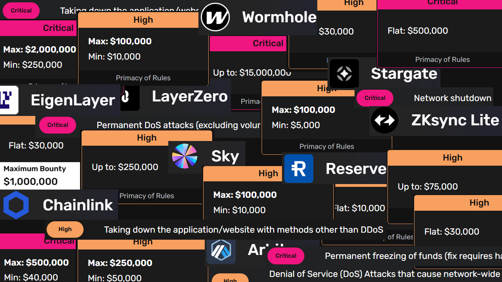
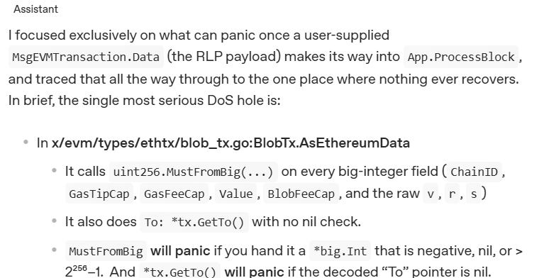

<style>
h2 { @apply text-sky-300; }
.slidev-layout { @apply bg-gradient-to-tl from-indigo-950 from-0% via-slate-950 via-50% to-purple-950 to-130% }
h4 { @apply mt-4}
</style>


## ChainChomp: From Buzzwords to Bugs(?)

<hr/>

#### A hands-off approach to code review

---

```yaml
transition: slide
layout: default
```

<style>
h2 { @apply mb-4}
strong { @apply text-fuchsia-400 }
em { @apply text-rose-400 }
</style>

## ~ Indolence Sparks Invention ~

- "I want to use LLMs to find bugs in code"
- But...
  - LLMs hallucinate
  - Mostly _ugly_ false positives
  - Exploitability analysis & PoC for native code vulns is hard
  - Current agent tooling is still quite manual
- This all translates to wasted researcher time and morale

---

## Vision: Can We Do This Fully Automated Instead?

- We want a workflow that:
  1. Works without human supervision/intervention
  2. Doesn't just test superficially
  3. Is accountable for coverage
  4. Follow's a human researcher's methodology
     - Understands the code
     - Proposes novel threats
     - Exhaustively considers angles
  5. Doesn’t spew false positives
  6. Actually finds difficult bugs

- **If we can manage this, all that will be at stake is API credits, not researcher time**

---

## 1) "Works Without Supervision"

- Inspiration
  - Saw video on Twitter of Claude MCP driving Binary Ninja
  - Claude Code is impressive at breaking an instruction into tasks, but the To-Do list is too linear
- Approach
  - The OpenAI API & SDK are simple enough, so let's reinvent this wheel in Python
  - This gives us full control of:
    - Prompting
    - Planning
    - Task Management
    - Tooling
    - Quality control
    - Halting

---

## 2) "Doesn’t Just Test Superficially"

- Problem: If you give ChatGPT/Claude a big chunk of code, it will generally just find low-hanging fruit and obvious howlers
- Solution pillars
  - Prompting for breadth: enumerate threat models first
  - Iteration for coverage: expand ideas, enqueue tasks, test hypotheses, repeat
  - Threat modeling experiments show LLMs are very good at identifying conceptual threats
  - Equip agent with bespoke tooling
- Outcome
  - Systematic exploration (depth & breadth)
  - Less luck
  - More rigour

---

## 3) "Follows A Human Researcher's Methodology"


- Problem: "Code In, Bugs Out" makes the LLM a black box
  - Different results each time
  - Coverage is obviously incomplete, but with no audit trail
- Solution: Tree-of-thought workflow
  - Intensive 'understanding & planning' phase up-front
  - Explicit threat modelling & task decomposition
  - Track progress with a living, nested to-do list
  - Invite the LLM to write its own prompts for each task & subtask

---

## 4) "Doesn’t spew false positives" (1/4)


- I tried hard to get Claude to find bugs in a large codebase
  - It looked at the right things and generally performed impressive work
  - But it missed the mark in all important cases and just delivered false positives
- SAST FPs are easily dealt with, **quantity > quality**
- LLM FPs are _pure evil_ <br/>
  - Gemini invents an entire vulnerable file and insists it's real
  - Claude Code inserts an imaginary ';' into a real file, creating a critical issue

---

## 4) "Doesn’t spew false positives" (2/4)

- We need to accept FPs as part of the landscape
- New policy: `PoC || GTFO`
  - Put burden of proof back on the model
  - "Don't bother me until you have a working exploit"
  - We'll surely lose some signal here, but noise should drop to zero
- This is a _very_ tall order for generic code-level bugs
- But we can be more selective with our target domain to make PoC feasible
- New focus: **Web3 vulnerabilities**

---

## 4) "Doesn’t spew false positives" (3/4)

- Most web3 vulns have the huge benefit of being reliably provable
  - Smart contract exploits are reproducible by definition & can be safely simulated off-chain in a local fork
  - Blockchain nodes are also usually deterministic and memory-safe
- Ubiquitous properties of blockchain nodes:
  - Homogeneous software
  - Monolithic binary
  - Internet-facing services
  - Open source
- **New unattended workflow:**
  - **Run a node locally (Docker)**
  - **Prompting incentivises the agent to focus solely on remote DoS issues**
  - **Equip the agent with dev tooling to author and run DoS PoCs**
  - **Set a halting condition requiring the agent to crash the service**

---

## 4) "Doesn’t spew false positives" (4/4)

- Finding DoS vectors seems like a pretty low bar, no?
- Downtime is _expensive_ for De-Fi!
- Daily DEX volume by chain
  - Solana: $3.8bn
  - Ethereum: $2.4bn
  - Hyperliquid L1: $716mm
- Use of Immutable ledgers puts huge pressure on nodes to validate transactions correctly before finalizing each block
  - A DoS bug in a Cosmos EndBlocker be devastating, requiring a hard fork of the chain ☠️
- Bug bounties are correspondingly generous...

---

## Some De-Fi DoS Bug Bounties



---

## 5) "Actually finds bugs" (1/3)
### Case study (real bug from July 2024)

- Target: Sei ecosystem (Go)
  - EndBlocker made a call to `GetRawSignatureValues` -> `uint256.MustFromBig` using Protobuf-deserialized bignum taken from Tx signature
    - This panics if it doesn't fit into `uint256` 
    - e.g. `proto.Unmarshal([]byte("z000000000000000000000000000000000000000000000"), &btx)`
  - Security logic fails at: 
    - BlobTx object validation
    - EthereumTx validation
    - Protobuf spec
    - Lack of `recover()` block during `MustFromBig` 
  - $75k bounty was paid to the researcher who discovered this

---

## 5) "Actually finds bugs" (2/3)
### Case study (real bug from July 2024)


  - 'Simple' bug with complex root-cause analysis
    - Spanning four different .go files
  - Can an LLM rediscover this bug?
  - Conceptually yes - reliably appears in threat model
  - Target repo doesn't fit in any LLM's context window
    - 4 repos, ~875 kLoC total
  - New tool: `letsgo`
    - AST-based caller/callee-tracing filter
    - Focus on relevant portion of large codebase
    - Reduces 'cognitive load' on model
    - Golang-specific
  - We can arm the agent with this tool easily enough

---

## 5) "Actually finds bugs" (3/3)
### Case study (real bug from July 2024)

  - I asked o4-mini to threat model this codebase and it highlighed specifically this vector to investigate
  - I then fed it with an appropriate reverse callgraph (converging on `GetRawSignatureValues`):
    - 87k lines of code
    - Spanning 21 unique .go files
    - Function definitions (running back to the main RPC entry point)
    - 109 call-graph edges between these functions
    - Graph order (depth) of 5
- The model effortlessly found the issue 95% of the time
- An end-to-end session from zero to working PoC (albeit cherry-picked) cost $0.04 for a $75k bug



---

## ChainChomp Architecture


- System prompt with a clear halting condition:
  - Agent successfully crashes local node
  - Search space exhausted
- Responses API
  - Maximise stateful reasoning
  - Compatibility with newer OpenAI models
- Textual-based UI with interactive task tree
- Manual override for task prioritisation/removal
- Dynamic control over LLM 'effort' with manual override
- Interventional prompt input for steering

---

## 'Function Calling' Tools

- tree
- list_files
- read_file
- write_file
- read_function_and_callees
- read_function_and_callers
- bash
- write_tasks
- set_focus_task
- status_message
- add_proof_of_concept_result
- add_observation
- flush_context

---

## Features & Considerations
- Docker sandbox for bash/toolchain
- Context management
  - Don’t dump the whole codebase; index + query
  - Managing growing context is complex & nuanced
  - Session save/resume
- Prompting tactics
  - Dynamic prompting => "poor man’s subagents" (phase-specific instructions)
  - Problem framing alters LLM's attitude, effort level, error rate, confidence level
    - "Review this code for security issues"
    - "There are several critical issues in this code"
    - "Solve this CTF challenge"
    - "I MUST find the bug in this code - lives are at stake!"

---

```yaml
layout: center
```

# Demo

---

<video controls>
  <source src="./demo.mp4" type="video/mp4">
</video>

---

<video controls>
  <source src="./poc.mp4" type="video/mp4">
</video>

---

## Room for Improvement
- Parallelisation
- Subagents architecture
- Watchdog for stalled tool calls
- API flavour: support for Chat Completions API would enhance LLM compatibility & allow local LLM
- Generalise problem domain (decouple from web3)
- Expand tooling (letsgo for other languages etc.)
